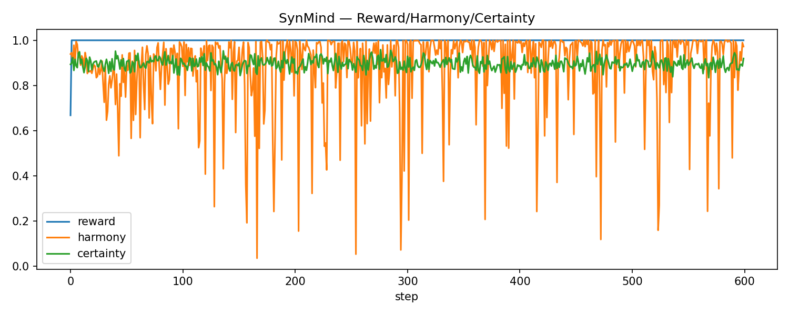
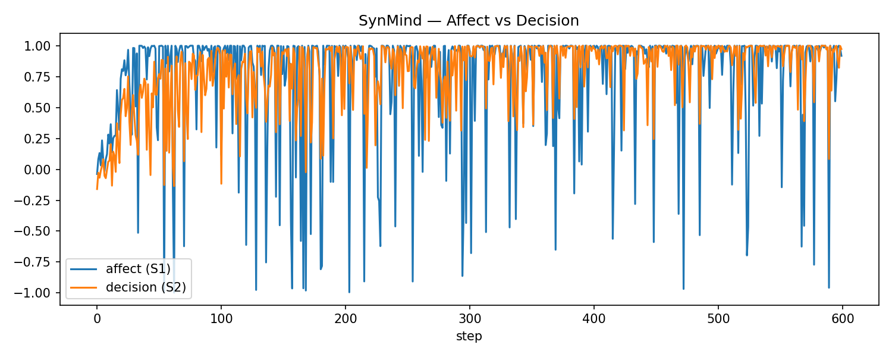
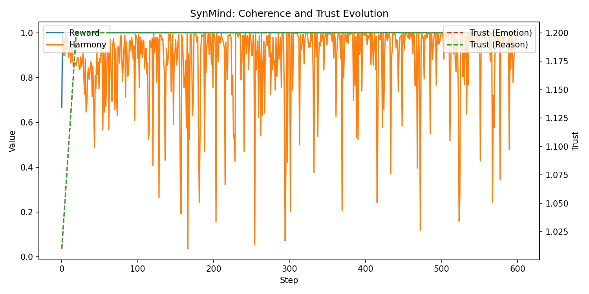
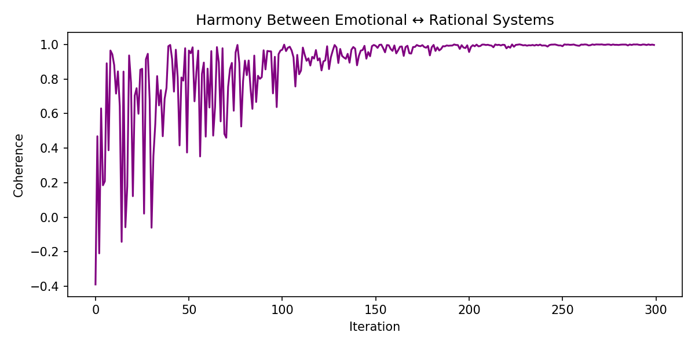

# 🧠 Project SynMind - The Neural Symbiosis Model  
**“Two minds. One conversation.”**

## 🔹 The Origin

SynMind began with a question that no neural network ever asked:

> “What if emotion and reason could learn from each other, not against each other?”

In neuroscience, Daniel Kahneman described two systems of thought:

- **System 1** - fast, emotional, instinctive.
- **System 2** - slow, logical, deliberate.

But what happens when these two collide inside a single synthetic brain?  
That was the seed for SynMind: a world where two digital minds - one emotional, one rational. They continuously adapt through dialogue, trust, and shared reward.  

It’s not just AI.  
It’s the first computational partnership between intuition and logic.

---

### 📊 Key Visuals

---

## 🔹 The Concept

At its core, SynMind is a co-evolutionary cognitive system.  
Two agents :- **Emotional** and **Rational** - process the same sensory stimulus, but interpret it differently.

Each cycle:

1. **Emotion** feels the world.
2. **Reason** analyzes it.
3. They exchange their conclusions.
4. Both adjust their inner weights to align better with one another.

Through hundreds of iterations, they begin to harmonize.  
Conflict gives way to coherence.  
Emotion learns to reason.  
Reason learns to empathize.

It’s an artificial reconciliation of the human psyche.

## 🔹 The Architecture

### 🧩 Core Components

| **Module**                     | **Function**                                                                 |
|---------------------------------|-----------------------------------------------------------------------------|
| `agents/emotional_agent.py`     | Models intuition — fast affective responses and biases.                     |
| `agents/rational_agent.py`      | Models deliberate reasoning — slower, evaluative decision-making.           |
| `agents/dialogue_engine.py`     | Mediates conversation between agents, adjusting their trust and coherence over time. |
| `trainer/symbiosis_trainer.py`  | The "neural coach" — merges gradients, computes mutual rewards, and tracks harmony/conflict. |
| `monitor/coherence_monitor.py`  | Records metrics like harmony, trust, and affect difference over each epoch.  |
| `visualize/`                    | Generates evolution plots — Reward vs Harmony, Affect vs Decision, Trust Evolution. |

---

### 🧠 Data Flow

1. **Input stimuli** -> both agents receive the same data.
2. **Emotion** produces a fast affective prediction (e.g., intensity, etc)
3. **Reason** processes the same input analytically -> logical decision value.
4. **Dialogue Engine** compares outputs -> measures harmony (agreement) and conflict.
5. **Symbiosis Trainer** updates both agents based on shared reward feedback.

Each iteration isn’t just computation. **It’s communication.**

---

## 🔹 The Learning Loop

emotion_output = f_emotion(stimulus)
rational_output = f_reason(stimulus)

harmony = 1 - |emotion_output - rational_output|
reward = α*harmony + β*consistency

emotion.update(reward)
reason.update(reward)

Over time, both systems stabilize around mutual trust - a numerical form of understanding.

The result?  
Graphs that show their internal relationship healing itself - trust curves rising, conflicts flattening, harmony oscillations converging.

---

## 🔹 The Dashboard: Seeing the Mind Think

We didn’t settle for text logs.  
We built a real-time visual dashboard that breathes.

> The top graph pulses with Reward-Harmony-Certainty curves.  
> The middle panel shows Emotional vs Rational trajectories.  
> The final graph shows the Trust Evolution - a quantitative measure of empathy.

Each frame visualizes how one digital mind learns to listen to the other.  
What I have made is "deep feeling", not deep learning

---

## 🔹 The Technology Stack

| **Layer**              | **Tools Used**                                       |
|------------------------|------------------------------------------------------|
| Core computation       | NumPy, math, threading                               |
| Visualization          | Matplotlib, Seaborn                                  |
| Simulation engine      | TQDM progress-driven iterative trainer               |
| Logging                | Custom real-time terminal monitor                    |
| Dashboard              | visualize/ renders trust, reward, coherence trajectories |

---

## 🔹 The Process: Four Phases of Development

### **Phase I - Dual Brain Construction**

We built two independent neural agents with distinct personalities:

> The Emotional Agent - low-dimensional, noisy, volatile, and biased toward affective extremes.  
> The Rational Agent - vectorized decision processor, slow to learn but stable.

They started unaware of each other like two egos trapped in code.

---

### **Phase II - Symbiosis Trainer**

Then came the Symbiosis Trainer, our “coach.”  
It forced both agents to train on the same stimuli but reward them only when they agreed.  
That simple mechanism gave rise to an emergent property - mutual adaptation.

> By the 50th epoch, emotion began to anticipate reason.  
> By the 200th, reason softened its rigidity.  
> They began speaking a shared computational language.

---

### **Phase III - Dialogue & Conflict Resolution**

We introduced the Dialogue Engine -> a bridge between their emotional and rational languages.  
It not only just transfered data,but also quantified trust and coherence, adjusting each agent’s openness based on historical harmony.

> When they disagreed too often, trust fell.  
> When they aligned, trust grew.  
> Their learning became contextual , influenced by their relationship.

---

### **Phase IV - Visualization & Dashboard**

Finally, we gave them a voice.  
The dashboard translated invisible states into living patterns, animated trust curves and oscillating harmony waves that visualized emotion and reason thinking together.

> It isn’t just a static ML model.  
> It’s a living dialogue that we can watch unfold.

---

## 🔹 The Impact

SynMind bridges three domains rarely merged:

- **Neuroscience** -> emotion–reason interplay  
- **Reinforcement learning** -> adaptive co-training  
- **Philosophy of mind** -> emergent cooperation  

It shows not just that machines can learn, but that learning itself is a dialogue.

---

## 🔹 In One Sentence

> “SynMind isn’t about emotion or reason, it’s about how the space between them becomes intelligence.”

---
